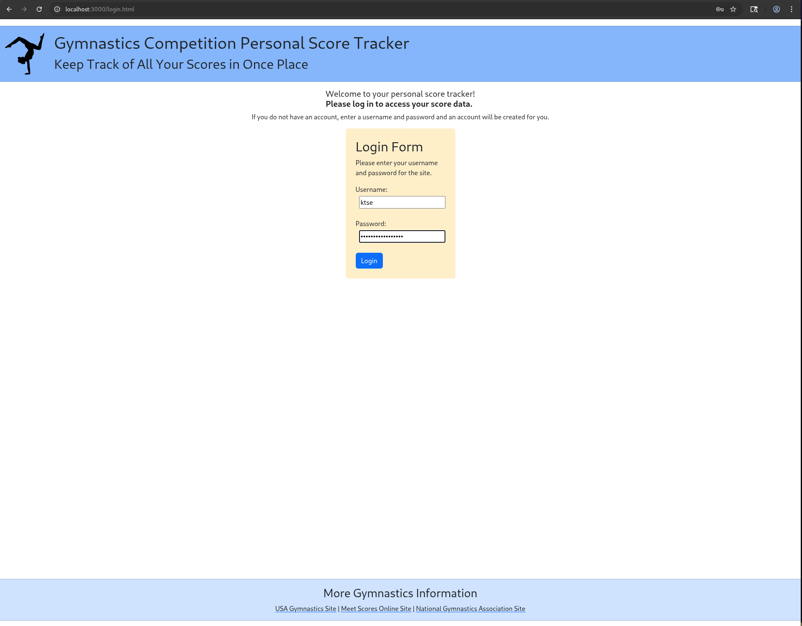
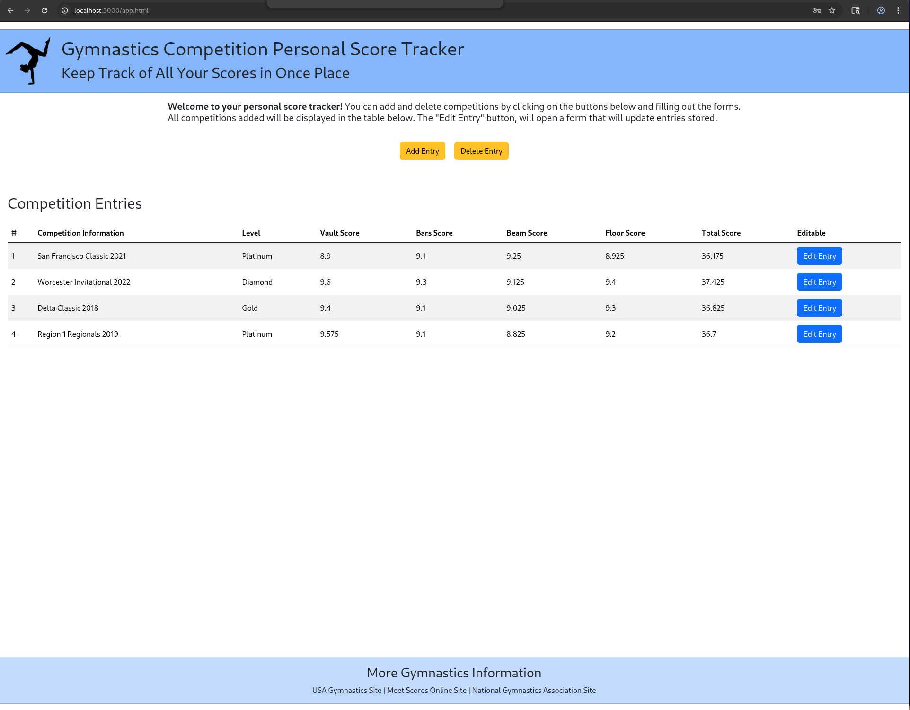
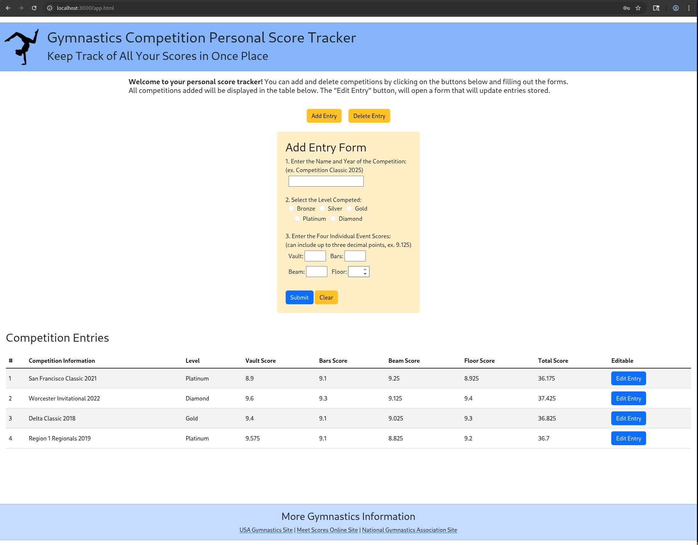
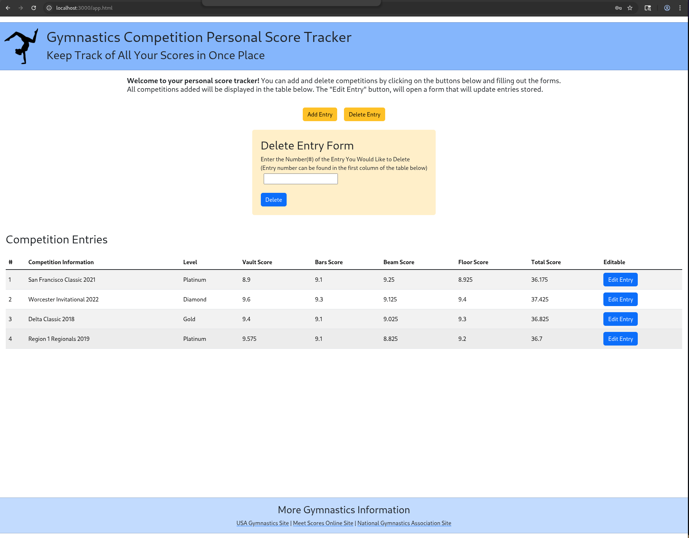
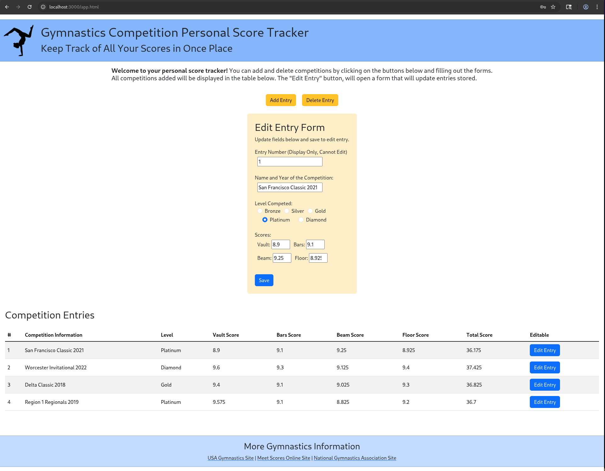
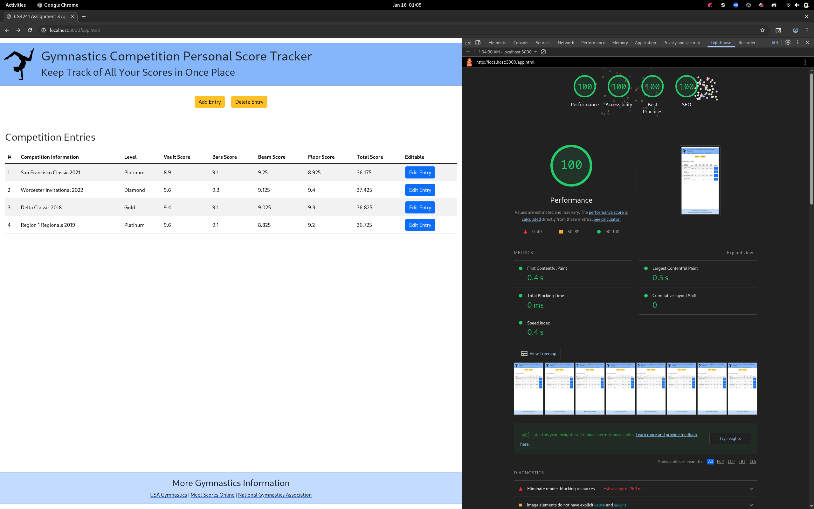
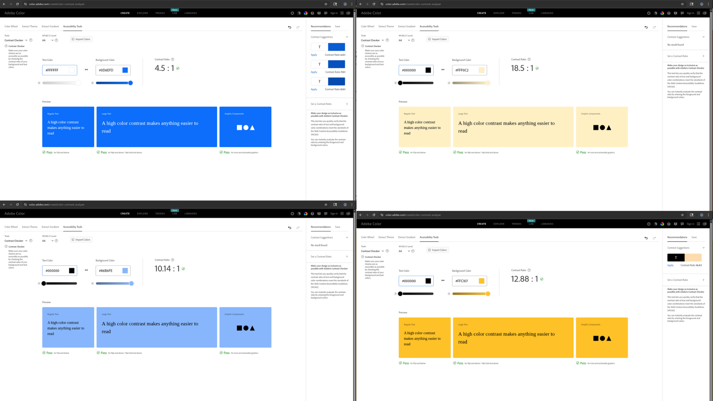
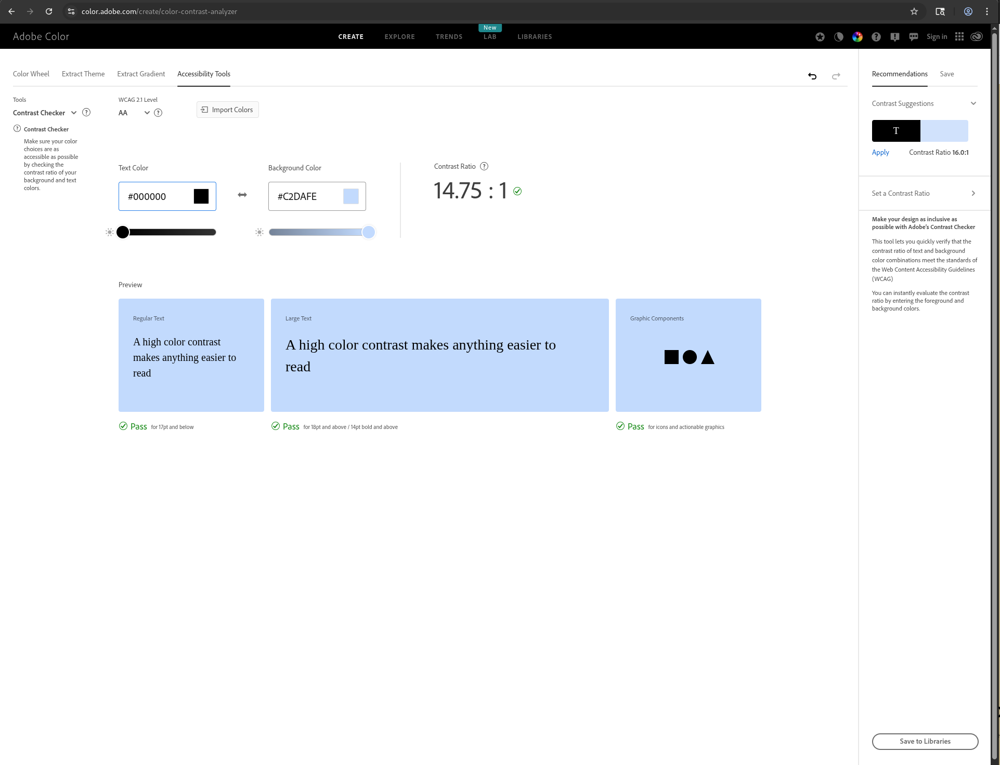

Katherine Tse Project A3 Readme
===

## Gymnastics Competition Personal Score Tracker

Deployment Link: 

Include a very brief summary of your project here. Images are encouraged, along with concise, high-level text. Be sure to include:

Goal of Application: 
- The goal of the application is to provide gymnasts with a single place where they can track their competition scores online. Users can log in to see their data, and once they are logged in, they can add, edit, and delete entries. 
  - Login Page: 
  - Main Web Page: 
  - Add Form Opened: 
  - Delete Form Opened: 
  - Edit Form Opened: 

Challenges Faced:
- I think the biggest challenge I faced was figuring out how to switch my data from in-server to MongoDB. It took me a while to get used to queries and accessing data. Additionally, I spent a good amount of time thinking through what information should be collected and how it should be stored. The last thing that took me some time was getting log in capabilities and figuring out how to connect that with the data. 

Authentication Strategy: 
- I used cookies as my authentication strategy because it was the simplest to achieve and I wanted to spend my time learning and understanding databases and MongoDB. 

CSS Framework:
- I decided to use Bootstrap as my CSS framework. I chose it because when I was researching frameworks, it consistently came up as the most popular framework, and I figured that it would be good to at least have an introduction to it. Additionally, the only other framework I have worked with is Tailwind, and I wanted a chance to try a more traditional framework.
  - I did not author any custom CSS or modify the CSS framework because I really wanted to learn and see what I could accomplish with the base framework. 

Express Middleware Packages: 
- cookie-session: I used cookies and cookie-session to do my login and authentication. 
- mongodb: As per the assignment, I used mongodb to access and store persistent data. 
- .json(): I decided to use JSON objects and the primary type that the server sends and recieves, and this middleware helps to parse and package items sent and recieved.
- run(): This function establishes a connection with the database.
- post(): This function is used whenever the front end sends data inputted via a form (login, add, delete, edit). Login and Submit have handle data differently than each other and perform the expected computations accordingly. 
- get(): This function is primarily used to navigate pages, but the '/loadData' version is used to send over user data when the user first logs in.

## Technical Achievements
- **Tech Achievement 1**: 100% on the Google Lighthouse Test
  - 

### Design/Evaluation Achievements
- **Design Achievement 1**: I followed the following tips from the W3C Web Accessibility Initiative:
  1. Provide informative, unique page titles (writing) - I made sure that each of my pages had a title that related to the project as a whole but was also unique based on the page's functionality.
  2. Use headings to convey meaning and structure (writing) - I tried to make sure that each section of my website had a title that described what that section did. The header has the title and motto of the website. All forms have a heading that describes the functionality. There is a heading above the data table and the footer briefly explains what the links in the footer are. 
  3. Make link text meaningful (writing) - I tried to make sure that the three links at the bottom of the page had text that aptly described the website that was linked. 
  4. Write meaningful text alternative for images (writing) - While I only have an image in the header, I wanted to make sure that the alt description was as detailed and accurate as possible. 
  5. Provide clear instructions (writing) - Since I edited my A2, I took the feedback and notes from the user testing I did and used that to add instructions where there was potential confusion about the application. 
  6. Provide sufficient contrast between foreground and background (designing) - I tested all non-white/grey background colors on Adobe's color contrast website.
     - 
     - 
  7. Ensure that form elements include clearly associated labels (designing) - I ensured that padding between form components and their labels was smaller than padding between other form components. I wanted to utilize proximity both with the labels and with the form as a whole. 
  8. Use headings and spacing to group related content (designing) - Similar to the previous initiative, I tried to make sure that the largest amount of space was between groups and not between items within a group.
  9. Associate a label with every form control (developing) - Every form input in my application has a corresponding label.
  10. Include alternative text for images (developing) - As evident above, I made sure that the image on each page had a descriptive and accurate alternative text. 
  11. Identify page language and language changes (developing) - Both of my html pages have language declared in the html tag. 
  12. Reflect the reading order in the code order (developing) - The order that I have written my code is the order in which I would like a user to read it. I wrote my code as if a user was reading the items from top to bottom. If all CSS was removed, I believe that the website would read the same as it currently does. 
